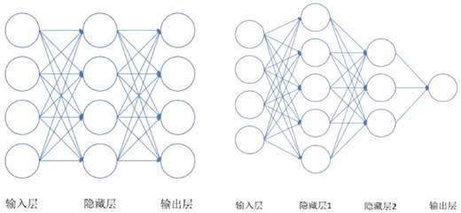
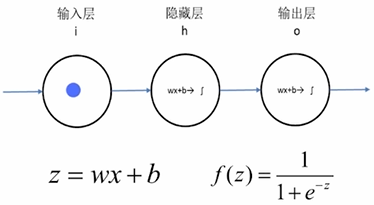
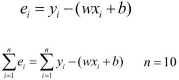
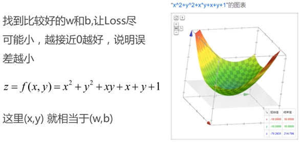
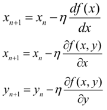
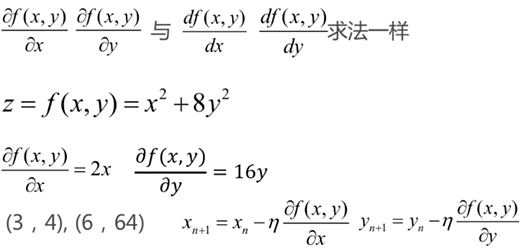
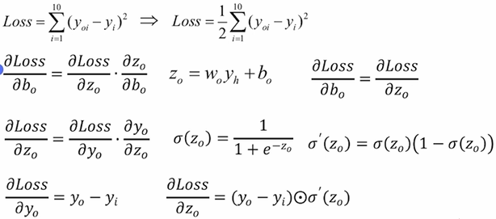
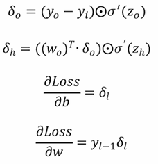
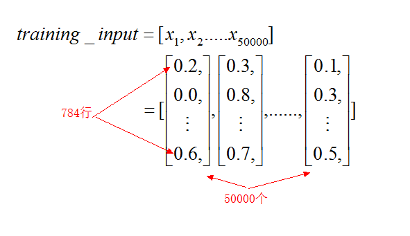
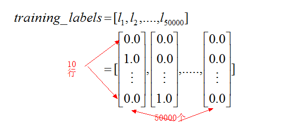

### 前馈神经网络（Feed forward Neural Network）

#### Back Propagation Networks - 反向传播网络

最简单的BP网络

#### RBF Networks - 径向基函数神经网络

#### 线性回归的训练
表达式：y = wx + b

误差：y = wx + b + e

全局误差总量：

损失：

提取公因式，其中A，B，C，D，E，F全部都是常数系数：

目标：

一元凸函数梯度下降更新公式：

二元凸函数梯度下降更新公式：

#### 神经网络的训练

训练过程：

初始化w，b

Loss(w, b)

挪动w，b逐步变化，直到Loss足够小

##### 前向传播

##### 反向传播

若前向传播过程未能得到期望的输出值，则逐层计算实际输出与预期输出的误差值，根据误差值调节权重

#### 随机梯度下降

#### MSNIT
##### MNIST数据集
[下载地址](https://github.com/mnielsen/neural-networks-and-deep-learning/tree/master/data)

##### load_data函数
training_data:是一个由两个元素构成的元组.

其中一个元素是测试图片集合,是一个50000*784的numpy ndarray(其中50000行就是数据的数量,784列就是一个数据的维度(这里是像素)).

第二个元素就是一个测试图片的标签集.是一个50000*1的numpy ndarray.其中指明了每行是一个什么数字…通俗的来说就是这个样子:

validation_data和test_data的结构和上面的training_data是一样的,只是数量(元素的行数)不一样.这两个是10000行.

##### load_data_wrapper函数
training_inputs

training_labels

training_data为zip函数组合,那么training_data为一个列表,其中每个元素是一个元组,二元组又有一个training_inputs和一个training_labels的元素组合而成.如下图

